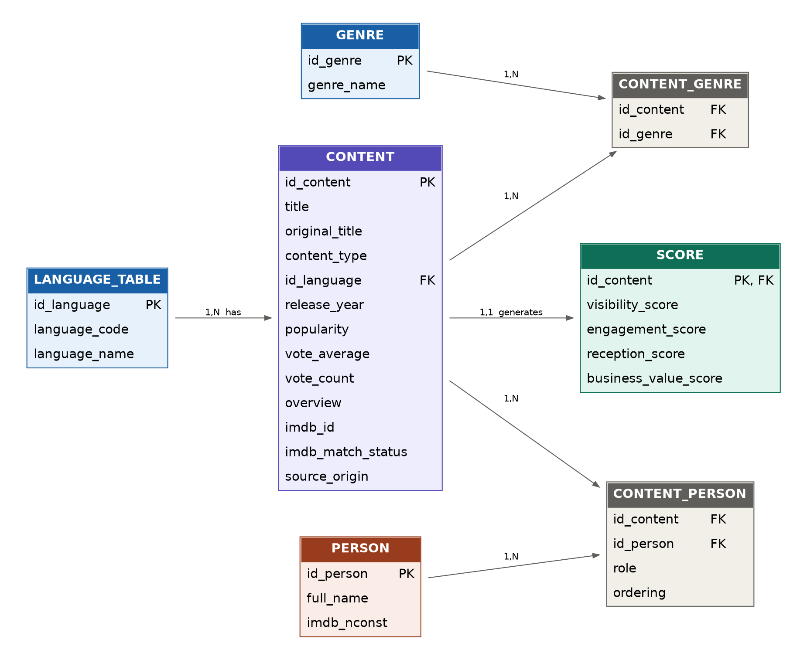

# Streaming-Marketing-Analytics
Visibility, Engagement & Business Value
-------
# 🚀 Overview
The streaming industry relies heavily on content performance to drive user acquisition, engagement, and retention. However, key business metrics such as revenue, watch time, or retention are not publicly available.

This project addresses that limitation by transforming publicly available content data into actionable marketing insights, combining **two independent data sources** — a REST API and an official data file — stored in a normalized relational database and queried with SQL.

The goal is to build a data-driven framework that estimates:

- Visibility (discoverability)
- Engagement (audience interaction)
- Audience reception (perceived quality)
- Business Value (estimated commercial potential)

The project combines data engineering, feature engineering, SQL analysis, and machine learning to support content marketing and strategy decisions.

-------
# 🎯 Business Objective
This project aims to answer key marketing questions:
- Which content has the highest commercial potential?
- What characteristics drive visibility and engagement?
- Are there hidden gems (low visibility, high engagement)?
- How can we identify high-value content segments — including by genre, language, cast, and director?

The output is an interactive dashboard + REST API that supports:
- Content prioritization
- Marketing investment decisions
- Content positioning strategies

-------
# 🗂️ Data Sources

This project deliberately combines **two different categories of source**, not two APIs of the same kind:

### Source 1 — API (primary catalog data)
- **TMDb** (The Movie Database)
- **TVMaze**

Fields collected: title, content type, popularity, vote count, vote average, genres, original language, release date, synopsis, adult flag, origin country.

### Source 2 — Official data file (IMDb Non-Commercial Datasets)
Downloaded directly from [datasets.imdbws.com](https://datasets.imdbws.com/):
- `title.basics.tsv.gz`
- `title.principals.tsv.gz`
- `title.crew.tsv.gz`
- `name.basics.tsv.gz`

This is a genuinely independent flat file, **not derived from the API data**. It's used to resolve each title's IMDb ID and attach **cast, directors, and cinematographers** — enrichment that would not be possible from the API alone. Matching logic, validation, and quality checks are in `02B_IMDB_DATASET_ENRICHMENT.ipynb`.

> Information courtesy of IMDb. Used with permission. Dataset used strictly under IMDb's non-commercial terms.

**Why not web scraping or Big Data?** Both were considered and deliberately left out of scope — the two sources above already provide sufficient volume and quality for the project's marketing-analytics objective, without the fragility of HTML scraping or the overhead of Big Data tooling that this dataset size doesn't require.

-------
# 🧠 Key Features

### 📈 1. Marketing Performance Framework
Custom metrics I designed for this project, built from public data:
- **Visibility Score** → based on popularity
- **Engagement Score** → based on vote count
- **Audience Reception Score** → based on ratings
- **Business Value Score** → weighted combination of the three above + recency

**Business Value Formula (designed for this project):**
```
Business Value Score =
    0.40 × Visibility Score
  + 0.30 × Engagement Score
  + 0.20 × Audience Reception Score
  + 0.10 × Recency
```
Visibility carries the highest weight because content can't generate value if it isn't discovered; engagement is second as the strongest available retention proxy; audience reception supports long-term brand value; recency is a light tie-breaker rather than a dominant factor.

### 🗄️ 2. Relational Database (Merise model)
Data from both sources is merged, cleaned, and loaded into a normalized **MySQL** database designed with the **Merise** method (conceptual → physical model). See `schema.sql` and the ERD below.

### 🔍 3. Exploratory Data Analysis (EDA)
- Distribution analysis (popularity, votes, ratings)
- Genre and language performance
- Movie vs TV comparison
- Time trends
- Visibility vs engagement relationships
- **Cast/director performance** (only possible thanks to Source 2)

### 🧩 4. Content Segmentation
Strategic classification:

| Segment | Description |
| --- | --- |
| 🎬 Tentpole | High visibility + high engagement |
| 💎 Hidden gems | Low visibility + high engagement |
| ⚠️ Overexposed | High visibility + low engagement |
| 📉 Low priority | Low visibility + low engagement |

### 🤖 5. Modeling
- K-Means clustering into performance profiles
- Regression model predicting Business Value Score from available variables

### 📊 6. Interactive Dashboard (Streamlit) + REST API (Flask)
Dashboard: global KPIs, visibility analysis, engagement analysis, Business Value segmentation, time evolution, content comparison.
API: `/titles` (filtered/paginated list), `/titles/{id}` (detail) — decouples data processing from data consumption.

-------
# ⚙️ Tech Stack
- **Python** — pandas, numpy, requests, scikit-learn
- **SQL** — MySQL (mysql-connector-python)
- **Visualization** — matplotlib / plotly
- **Dashboard** — Streamlit
- **API** — Flask
- **Version Control** — GitHub

-------
# 🗄️ Database & ERD

The database follows a Merise-based relational model: `CONTENT` (central entity, from Source 1) links to `LANGUAGE_TABLE` and `GENRE` (dimensions), `SCORE` (derived metrics, 1:1), and — via the associative `CONTENT_PERSON` table — to `PERSON` (cast/directors/cinematographers, from Source 2).



Full DDL: `schema.sql`. Current database: **12,659 content records, 73,066 unique people, 134,877 cast/crew credit links.**

-------
# 🔄 Data Pipeline

1. **Extraction**
   - `01_DATA_API.ipynb` — API calls (TMDb, TVMaze) → Source 1
   - `02B_IMDB_DATASET_ENRICHMENT.ipynb` — IMDb data file download + matching → Source 2
2. **Cleaning & Aggregation**
   - Missing values, standardization, deduplication, cross-source merge on `imdb_id`
3. **EDA**
   - Statistical analysis, visualization (`EDA_GRAPHS/`)
4. **Feature Engineering**
   - Visibility / Engagement / Audience Reception / Business Value scores, time variables, content categorization
5. **Database**
   - `schema.sql` — creates the MySQL schema (Merise model)
   - `08_IMPORT_TO_DB.ipynb` — loads the merged dataset into the database
6. **SQL Analysis**
   - `09_SQL_QUERIES.sql` — documented analytical queries (top content, genre/language performance, hidden gems, director performance)
7. **Modeling**
   - Clustering + regression on Business Value Score
8. **Visualization & API**
   - Streamlit dashboard (`streamlit_app.py`) + Flask API

-------
# 🔧 Setup

```bash
pip install -r requirements.txt
```

Create a `.env` file in the project root (never commit this file — it's in `.gitignore`):
```
DB_HOST=localhost
DB_USER=root
DB_PASSWORD=your_password
DB_NAME=streaming_marketing
```

Run in order: `schema.sql` on your MySQL server → `01_DATA_API.ipynb` → `02B_IMDB_DATASET_ENRICHMENT.ipynb` → `08_IMPORT_TO_DB.ipynb` → `09_SQL_QUERIES.sql` (optional, exploratory) → `streamlit run streamlit_app.py`.

-------
# 📌 Key Insights
- High visibility does not guarantee high engagement
- Some content shows strong engagement despite low exposure (hidden gems)
- TV shows and movies exhibit different performance patterns over time
- Genre and language significantly impact performance
- Combining the API with the IMDb data file surfaces director- and cast-level performance that neither source could produce alone
- Business value is driven by a combination of factors, not a single metric

-------
# ⚠️ Limitations
- Scores are proxies I designed, not real revenue/retention data
- A negative correlation between `popularity` and `visibility_score`/`engagement_score` was identified during EDA and needs further investigation before the scores are treated as fully validated
- Current segmentation thresholds (hidden gem, tentpole) produce heavily skewed segment sizes; percentile-based thresholds would likely be more actionable
- Catalog is skewed toward English-language and TV content, reflecting the source APIs' coverage
- Does not account for platform-specific algorithms

-------
# 🔮 Future Improvements
- Recalibrate segmentation thresholds (percentile-based)
- Investigate and fix the popularity/visibility-score correlation anomaly
- Add qualitative/topic features from synopses (NLP / embeddings)
- Validate scores against real business data where possible

-------
# 🔐 Data & Compliance
- Uses publicly available data only: content metadata (Source 1) and publicly published professional credit information — cast, director, cinematographer attributions (Source 2)
- No personal or sensitive data about private individuals is collected; credit attributions are professional, not personal, data
- No end-user data is collected or processed
- Credentials are never hardcoded — stored in a local `.env` file excluded from version control
- IMDb data used under its stated non-commercial terms

-------
# 👩‍💻 Author
Blanca Fernandez Rivas

-------
# ⭐ Final Note
This project demonstrates how two genuinely different public data sources — a REST API and an official data file — can be combined, stored in a properly normalized relational database, and queried with SQL to produce marketing-actionable proxies for content performance, going beyond what either source could support alone.
